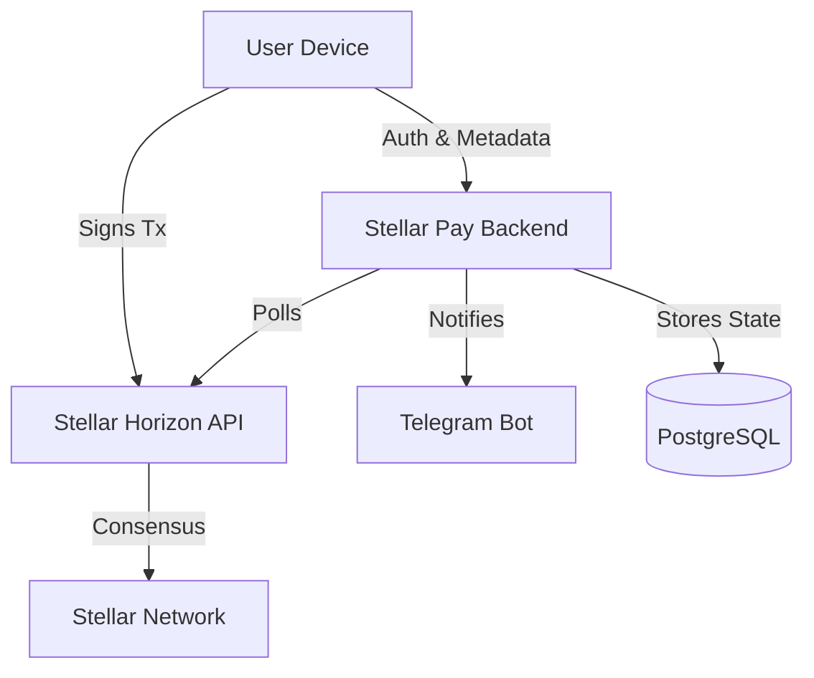

# Stellar Pay: The Non-Custodial Financial Revolution

[](https://www.stellar.org/) [](#technical-stack) [](#technical-stack) [](LICENSE)

> 🚀 Next-gen, non-custodial finance stack for cross-border payments, RWA, and on/off-ramps on the Stellar Network.

| Quick Links | Dev Env | Deploy |
| --- | --- | --- |
| [Getting Started](#getting-started) | `node >= 20` · `pnpm` · `docker` | [Docker Compose](#deployment-guide) · Railway/Vercel |
| [Architecture](#core-architecture) | Backend: `npm run dev` | Backend: `nixpacks.toml` |
| [Features](#features-deep-dive) | Indexer: `npm run indexer` | Frontend: Vercel |

---

## 📖 Table of Contents

1. [**Introduction**](#introduction)
2. [**The Philosophy**](#the-philosophy)
3. [**Core Architecture**](#core-architecture)
4. [**Platform Snapshot**](#platform-snapshot)
5. [**Features Deep Dive**](#features-deep-dive)
   * [Non-Custodial Wallet](#1-non-custodial-wallet)
   * [On/Off Ramps](#2-onoff-ramps)
   * [KYC & Compliance](#3-kyc--compliance)
   * [Real-World Assets (RWA)](#4-real-world-assets-rwa)
   * [Smart Contracts (Soroban)](#5-smart-contracts-soroban)
6. [**Technical Stack**](#technical-stack)
7. [**Getting Started**](#getting-started)
8. [**Deployment Guide**](#deployment-guide)
9. [**Roadmap**](#roadmap)

---

## Introduction

**Stellar Pay** is not just a wallet; it's a financial operating system. In a world where cross-border payments are slow and expensive, and traditional banking excludes billions, Stellar Pay bridges the gap between fiat and crypto.

Built on the **Stellar Network**, it leverages the speed (seconds), cost (fractions of a cent), and native asset issuance capabilities of the blockchain to deliver a seamless user experience. Unlike centralized exchanges, Stellar Pay is **non-custodial**—you own your keys, you own your money.

---

## The Philosophy

We believe in three core pillars:

1.  **Sovereignty**: Users must retain absolute control over their funds. No black boxes.
2.  **Compliance**: To interface with the real world (banks, merchants), we must handle Identity (KYC) and AML securely without compromising user privacy on-chain where possible.
3.  **Utility**: Crypto shouldn't just sit in a wallet. It should collect interest, pay for coffee, or serve as collateral for a loan.

---

## Core Architecture

Stellar Pay operates as a hybrid application:

*   **The Trust Layer**: The Stellar Ledger (L1). All value transfer happens here.
*   **The Service Layer**: Our backend. It acts as an indexer, notification engine, and smart contract orchestrator. It does **not** hold private keys.
*   **The Interface**: A sleek Web and Mobile app that communicates with the Service Layer for metadata and the Trust Layer for signing.



---

## Platform Snapshot

| Pillar | What it covers | Proof points |
| --- | --- | --- |
| Wallet & Signing | Local key generation, encrypted storage, transaction signing flows | Non-custodial by design; keys never touch the backend |
| Liquidity & Ramps | Fiat on/off ramps, FX, settlement | INR/USD on-ramp and off-ramp intents, price-aware flows |
| Compliance | Tiered KYC, PII isolation, status flags on-chain | KYC session + status endpoints, separated `kyc_records` table |
| Indexing & State | Ledger polling, webhook-ready events, unified tx history | Custom indexer with restart-safe cursor in `indexer_state` |
| Notifications | Telegram linking and alerts | `telegram_links` table and bot webhook endpoints |

> TL;DR: Sign locally, settle on Stellar, coordinate off-chain services through a thin backend.

---

## Features Deep Dive

### 1. Non-Custodial Wallet
At the heart of Stellar Pay is the `LumenVault` module. It generates and encrypts keys locally on the user's device.
- **Security**: Keys are encrypted with a user PIN and never leave the device unencrypted.
- **Multi-Asset**: Native support for XLM, USDC, and custom issued assets.

### 2. On/Off Ramps
We simplify the movement of money.
- **On-Ramp**: Convert Fiat (INR/USD) to Crypto (USDC/XLM) via integrated payment gateways (simulated).
- **Off-Ramp**: Withdraw Crypto directly to a bank account via SEPA/ACH/IMPS bridges.

### 3. KYC & Compliance
A tiered KYC system ensures regulatory compliance for high-value transactions.
- **Level 1**: Basic info (Simulated verification).
- **Level 2**: Document verification (Passport/ID).
- **Storage**: Sensitive PII is stored off-chain in secured databases; only status flags (`is_verified`) are associated with the wallet address.

### 4. Real-World Assets (RWA)
Tokenize the world. Stellar Pay supports holding and trading:
- **Real Estate**: Fractional ownership of properties.
- **Commodities**: Gold/Silver backed tokens.
- **Treasuries**: Yield-bearing government bonds.

### 5. Smart Contracts (Soroban)
Leveraging Stellar's smart contract platform, Soroban:
- **Escrow**: Trustless exchange of assets.
- **Lending**: Collateralized loans using your crypto holdings.
- **Vesting**: Time-locked asset distribution.

---

## Technical Stack

### Frontend
- **Web**: Next.js 14, React, TailwindCSS, Framer Motion.
- **Mobile**: React Native (Expo), NativeWind.
- **State**: Zustand for global state management.

### Backend
- **Runtime**: Node.js (TypeScript).
- **Framework**: Express.js.
- **ORM**: Prisma.
- **Database**: PostgreSQL (Supabase).
- **Worker**: Custom Polling Indexer for Stellar events.

### Blockchain
- **SDK**: `@stellar/stellar-sdk`.
- **Network**: Stellar Testnet (Configurable).

### Repo Map

| Path | What lives here |
| --- | --- |
| `backend/` | Express API, indexer worker, Prisma schema, Supabase migrations |
| `backend/contracts/` | Soroban contracts (Rust) for escrow, RWA, credit flows |
| `frontend/web/` | Next.js web app, components, hooks, Supabase client |
| `frontend/mobile/` | Expo mobile app (RN), shared styling and hooks |
| `__tests__/` | API, component, contract, and integration test suites |

---

## Getting Started

### Prerequisites
- Node.js v20+
- Docker (optional, for easy deployment)
- A Supabase project (for Database)

### Installation

1.  **Clone the Repository**
    ```bash
    git clone https://github.com/your-username/stellar-pay.git
    cd stellar-pay
    ```

2.  **Environment Setup**
    Copy the example env file and fill in your Supabase & Stellar credentials.
    ```bash
    cp .env.example .env
    ```

3.  **Install Dependencies**
    ```bash
    ./setup.sh
    ```

4.  **Run Development Servers**
    *   **Backend & Indexer**:
        ```bash
        cd backend
        npm run dev
        # In a new terminal
        npm run indexer
        ```
    *   **Frontend**:
        ```bash
        cd frontend/web
        npm run dev
        ```

Visit `http://localhost:3000` to access the web interface.

### Quick Dev Launch (Cheat Sheet)

| Service | Command | Port |
| --- | --- | --- |
| Backend API | `cd backend && npm run dev` | 3001 |
| Indexer Worker | `cd backend && npm run indexer` | background job |
| Web App | `cd frontend/web && npm run dev` | 3000 |
| Mobile (Expo) | `cd frontend/mobile && npm start` | 8081 (Metro) |

> Tip: keep backend and indexer in separate terminals; frontend auto-reloads.

---

## Deployment Guide

### Docker (Production)
We provide a production-ready `docker-compose.yml`.

1.  Ensure `.env` is configured.
2.  Run:
    ```bash
    docker-compose up -d --build
    ```
This spins up the API on port 3001 and the background indexer.

### Cloud (Railway/Vercel)
- **Frontend**: Deploy `frontend/web` to Vercel.
- **Backend**: Deploy `backend` to Railway. Use the provided `nixpacks.toml` for automatic configuration.

### Deployment Matrix

| Target | Frontend | Backend | Notes |
| --- | --- | --- | --- |
| Local Dev | `npm run dev` | `npm run dev` | Pair with local Postgres/Supabase |
| Docker | `docker-compose up -d` | Included | Good for parity testing |
| Railway | Deploy `frontend/web` elsewhere | `railway up` (uses `nixpacks.toml`) | Provide env vars + DATABASE_URL |
| Vercel | `vercel` (Next.js) | Host backend separately | Configure NEXT_PUBLIC envs |

---

## Roadmap

*   [x] **Phase 1**: Core Wallet & Transactions
*   [x] **Phase 2**: Dashboard & UI Polish
*   [x] **Phase 3**: RWA & Mock Data Integration
*   [x] **Phase 4**: Real Backend Integration
*   [x] **Phase 5**: Event Indexer & Notifications
*   [ ] **Phase 6**: Mainnet Launch & Audits
*   [ ] **Phase 7**: Institutional Custody Integration

---

*Built with ❤️ for the Stellar Community.*
