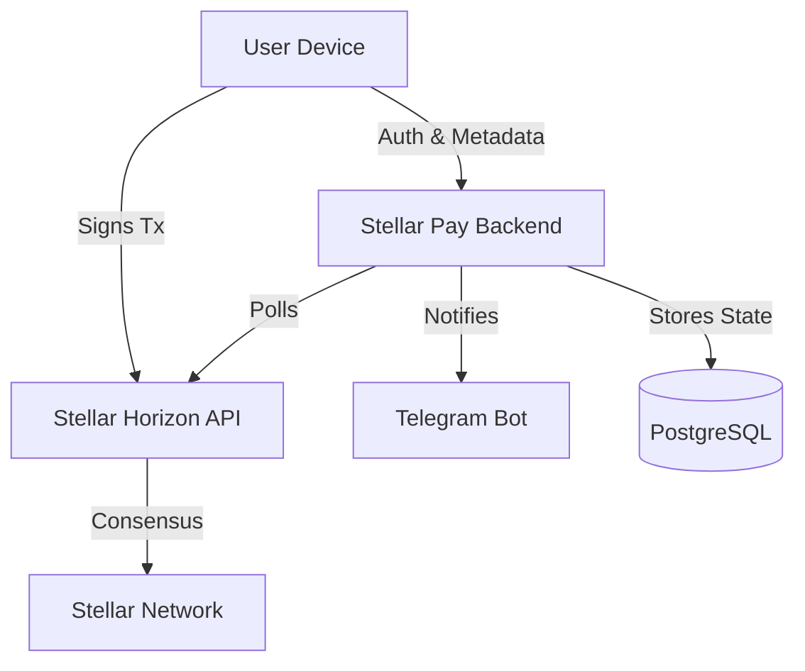

# Stellar Pay: The Non-Custodial Financial Revolution

Welcome to **Stellar Pay** (formerly LumenPay). This documentation is designed to guide you through the philosophy, architecture, and implementation of a next-generation financial platform built on the Stellar Network.

---

## 📖 Table of Contents

1.  [**Introduction**](#introduction)
2.  [**The Philosophy**](#the-philosophy)
3.  [**Core Architecture**](#core-architecture)
4.  [**Features Deep Dive**](#features-deep-dive)
    *   [Non-Custodial Wallet](#1-non-custodial-wallet)
    *   [On/Off Ramps](#2-onoff-ramps)
    *   [KYC & Compliance](#3-kyc--compliance)
    *   [Real-World Assets (RWA)](#4-real-world-assets-rwa)
    *   [Smart Contracts (Soroban)](#5-smart-contracts-soroban)
5.  [**Technical Stack**](#technical-stack)
6.  [**Getting Started**](#getting-started)
7.  [**Deployment Guide**](#deployment-guide)
8.  [**Roadmap**](#roadmap)

---

## Introduction

**Stellar Pay** is not just a wallet; it's a financial operating system. In a world where cross-border payments are slow and expensive, and traditional banking excludes billions, Stellar Pay bridges the gap between fiat and crypto.

Built on the **Stellar Network**, it leverages the speed (seconds), cost (fractions of a cent), and native asset issuance capabilities of the blockchain to deliver a seamless user experience. Unlike centralized exchanges, Stellar Pay is **non-custodial**—you own your keys, you own your money.

---

## The Philosophy

We believe in three core pillars:

1.  **Sovereignty**: Users must retain absolute control over their funds. No black boxes.
2.  **Compliance**: To interface with the real world (banks, merchants), we must handle Identity (KYC) and AML securely without compromising user privacy on-chain where possible.
3.  **Utility**: Crypto shouldn't just sit in a wallet. It should collect interest, pay for coffee, or serve as collateral for a loan.

---

## Core Architecture

Stellar Pay operates as a hybrid application:

*   **The Trust Layer**: The Stellar Ledger (L1). All value transfer happens here.
*   **The Service Layer**: Our backend. It acts as an indexer, notification engine, and smart contract orchestrator. It does **not** hold private keys.
*   **The Interface**: A sleek Web and Mobile app that communicates with the Service Layer for metadata and the Trust Layer for signing.



---

## Features Deep Dive

### 1. Non-Custodial Wallet
At the heart of Stellar Pay is the `LumenVault` module. It generates and encrypts keys locally on the user's device.
- **Security**: Keys are encrypted with a user PIN and never leave the device unencrypted.
- **Multi-Asset**: Native support for XLM, USDC, and custom issued assets.

### 2. On/Off Ramps
We simplify the movement of money.
- **On-Ramp**: Convert Fiat (INR/USD) to Crypto (USDC/XLM) via integrated payment gateways (simulated).
- **Off-Ramp**: Withdraw Crypto directly to a bank account via SEPA/ACH/IMPS bridges.

### 3. KYC & Compliance
A tiered KYC system ensures regulatory compliance for high-value transactions.
- **Level 1**: Basic info (Simulated verification).
- **Level 2**: Document verification (Passport/ID).
- **Storage**: Sensitive PII is stored off-chain in secured databases; only status flags (`is_verified`) are associated with the wallet address.

### 4. Real-World Assets (RWA)
Tokenize the world. Stellar Pay supports holding and trading:
- **Real Estate**: Fractional ownership of properties.
- **Commodities**: Gold/Silver backed tokens.
- **Treasuries**: Yield-bearing government bonds.

### 5. Smart Contracts (Soroban)
Leveraging Stellar's smart contract platform, Soroban:
- **Escrow**: Trustless exchange of assets.
- **Lending**: Collateralized loans using your crypto holdings.
- **Vesting**: Time-locked asset distribution.

---

## Technical Stack

### Frontend
- **Web**: Next.js 14, React, TailwindCSS, Framer Motion.
- **Mobile**: React Native (Expo), NativeWind.
- **State**: Zustand for global state management.

### Backend
- **Runtime**: Node.js (TypeScript).
- **Framework**: Express.js.
- **ORM**: Prisma.
- **Database**: PostgreSQL (Supabase).
- **Worker**: Custom Polling Indexer for Stellar events.

### Blockchain
- **SDK**: `@stellar/stellar-sdk`.
- **Network**: Stellar Testnet (Configurable).

---

## Getting Started

### Prerequisites
- Node.js v20+
- Docker (optional, for easy deployment)
- A Supabase project (for Database)

### Installation

1.  **Clone the Repository**
    ```bash
    git clone https://github.com/your-username/stellar-pay.git
    cd stellar-pay
    ```

2.  **Environment Setup**
    Copy the example env file and fill in your Supabase & Stellar credentials.
    ```bash
    cp .env.example .env
    ```

3.  **Install Dependencies**
    ```bash
    ./setup.sh
    ```

4.  **Run Development Servers**
    *   **Backend & Indexer**:
        ```bash
        cd backend
        npm run dev
        # In a new terminal
        npm run indexer
        ```
    *   **Frontend**:
        ```bash
        cd frontend/web
        npm run dev
        ```

Visit `http://localhost:3000` to access the web interface.

---

## Deployment Guide

### Docker (Production)
We provide a production-ready `docker-compose.yml`.

1.  Ensure `.env` is configured.
2.  Run:
    ```bash
    docker-compose up -d --build
    ```
This spins up the API on port 3001 and the background indexer.

### Cloud (Railway/Vercel)
- **Frontend**: Deploy `frontend/web` to Vercel.
- **Backend**: Deploy `backend` to Railway. Use the provided `nixpacks.toml` for automatic configuration.

---

## Roadmap

*   [x] **Phase 1**: Core Wallet & Transactions
*   [x] **Phase 2**: Dashboard & UI Polish
*   [x] **Phase 3**: RWA & Mock Data Integration
*   [x] **Phase 4**: Real Backend Integration
*   [x] **Phase 5**: Event Indexer & Notifications
*   [ ] **Phase 6**: Mainnet Launch & Audits
*   [ ] **Phase 7**: Institutional Custody Integration

---

*Built with ❤️ for the Stellar Community.*
