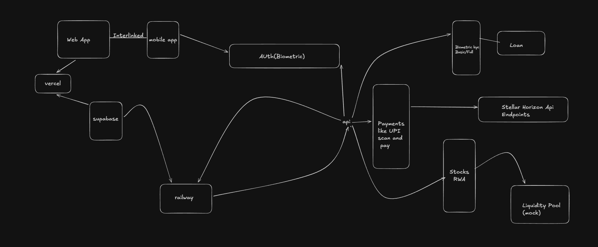

# LumenPay 🌟
> **Embedded Wallet–First Payments & Finance Platform on Stellar**



## 📖 Overview

**LumenPay** (formerly known as StellarPay) is a next-generation financial platform that combines the ease of UPI/Neobank apps with the security of **non-custodial** blockchain technology.

We abstract away Web3 complexity using our **embedded wallet engine (LumenVault)**, allowing users to make payments, invest in RWAs, and take loans without managing seed phrases manually, while ensuring **Keys never leave the user's device.**

## 🎯 Vision

To make self-custodial blockchain payments feel as simple as everyday UPI apps, without compromising security, identity, or ownership.

### Core Philosophy
*   **Wallet = Identity:** You are not a database row. You are a Public Key.
*   **Your Keys, Your Crypto:** Private keys utilize secure hardware storage on the device.
*   **Backend as Orchestrator:** The server builds transactions, but **never signs** them.
*   **Invisible Web3:** No "Connect Wallet" popups. Just "Login" and "Pay".

---

## 🏗️ System Architecture

LumenPay uses a **Hybrid Architecture** where the frontend is the signer and the backend is the builder.

### 1. LumenVault (The Client Side)
The "Heart" of the system. Embedded directly into the Web and Mobile apps.
*   **Mobile:** Uses `Expo SecureStore` to encrypt private keys on-device.
*   **Web:** Uses encrypted `localStorage` / IndexDB with a PIN.
*   **Responsibilities:** Key generation, signing auth challenges, signing transactions.

### 2. LumenPay Core (The Backend)
A stateless orchestration layer powered by Next.js.
*   **Auth:** Challenge/Response (Nonce) authentication with Stellar Keys.
*   **Services:**
    *   **Payment Engine:** Builds valid Stellar XDRs for standard payments.
    *   **Indexer:** Listens for on-chain events to update the UI instantly.
    *   **KYC Engine:** Gates features (Stocks, Loans) based on compliance levels.
    *   **Market Data:** Fetches live prices for RWAs (Stocks) from AlphaVantage.

### 3. The Blockchain (Stellar + Soroban)
The source of truth.
*   **Settlement:** Fast, low-fee XLM/USDC transfers.
*   **Smart Contracts:** Soroban contracts handle Escrow logic for loans and conditional payments.

---

## 🚀 Features

### ✅ Payments (UPI Style)
*   **Scan & Pay:** QR code interoperability.
*   **Universal Search:** Send to `@username`, phone number, or Stellar address.
*   **Non-Custodial:** Funds move directly from User A to User B (or Contract).

### ✅ Financial Services
*   **Real World Assets (RWA):** Invest in synthetic stocks (Apple, Tesla) mirrored on-chain.
*   **Crypto-Backed Loans:** Lock XLM as collateral in a Soroban Contract to instantly borrow stablecoins.
*   **Biometric Security:** FaceID/TouchID required for every transaction.

### ✅ Developer & Admin
*   **Event Indexing:** Historic transaction data synced to Supabase for fast querying.
*   **Settlement Simulator:** Mock banking rails for hackathon demos.
*   **KYC Gates:** Role-based access control (KYC0, KYC1, KYC2).

---

## 🛠️ Tech Stack

*   **Frontend:** Next.js 14, Tailwind CSS, Framer Motion
*   **Mobile:** React Native, Expo Router, NativeWind
*   **Blockchain:** Stellar SDK, Soroban (Rust)
*   **Database:** Supabase (PostgreSQL)
*   **State Management:** React Query, Zustand

---

## ⚡ Getting Started

### Prerequisites
*   Node.js 18+
*   Supabase Account
*   Stellar Laboratory Account (Testnet)

### 1. Web App Setup
```bash
# Install dependencies
npm install

# Setup Environment
cp .env.example .env.local
# Fill in your Supabase & Stellar Testnet details

# Run Development Server
npm run dev
```

### 2. Mobile App Setup
```bash
cd mobile
npm install

# Setup Environment
# Ensure you copy valid config to mobile/constants/Config.ts (created during setup)

# Run Expo
npx expo start
```

### 3. Deploy Contracts (Optional)
```bash
cd contracts
cargo build --target wasm32-unknown-unknown
soroban contract deploy --wasm target/wasm32-unknown-unknown/release/escrow.wasm
```

---

## 🔮 Roadmap

*   [x] **Phase 1:** Core Wallet & Payments (Testnet)
*   [ ] **Phase 2:** Soroban Escrow Integration
*   [ ] **Phase 3:** RWA Stock Trading Mockup
*   [ ] **Phase 4:** Mainnet Launch & Anchor Integration

---

**Built with ❤️ for the Stellar Ecosystem.**
